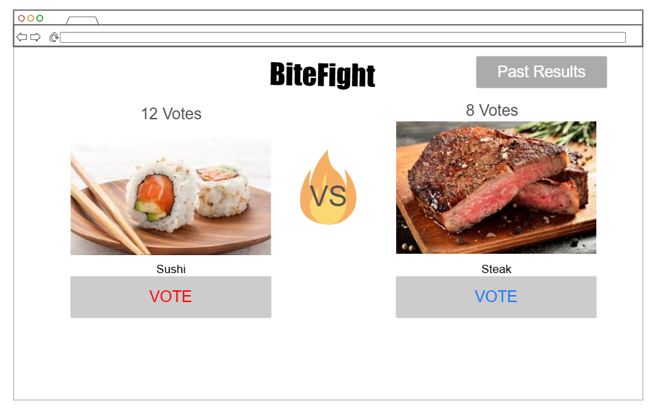
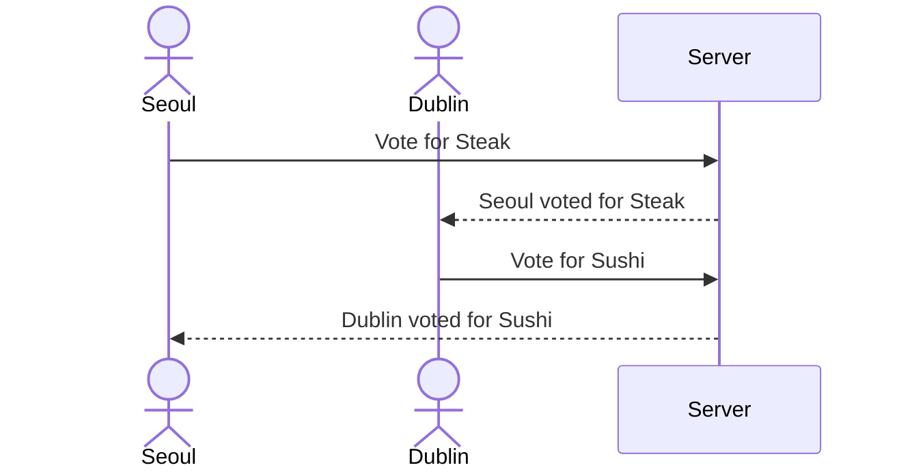

# BiteFight

[My Notes](notes.md)

You will log in to my game, and then two food items will be presented for you to vote on, along with anyone else currently on the website. The snack that gets the most votes in the time the voting is active will win, and the next round of voting will start with two new food items. You will be able to look at past results to see how your favorite foods have done.

## 🚀 Specification Deliverable

For this deliverable I did the following. I checked the box `[x]` and added a description for things I completed.

- [x] Proper use of Markdown
- [x] A concise and compelling elevator pitch
- [x] Description of key features
- [x] Description of how you will use each technology
- [x] One or more rough sketches of your application. Images must be embedded in this file using Markdown image references.

### Elevator pitch

We all get hangry sometimes, but we rarely have an outlet for it. That’s where BiteFight comes in. BiteFight lets users log in and vote on the foods they’re craving right now, turning hunger into friendly competition. Watch votes update live, argue over food loyalties, and distract yourself just long enough to make it to dinner.

### Design

Here is a sequence diagram to show how users and the backend interact

### Key features

- Food poll voting
- Results are stored
- Secure login
- Allows users to see what others are voting for

### Technologies

I am going to use the required technologies in the following ways.

- **HTML** - Use HTML for the webpages, have links to go around the site, a main page to log in, and one for voting
- **CSS** - Style the website to look nice and easy to understand 
- **React** - Applies the votes, and can be used to let people log in
- **Service** - User logins, registrations, and logouts, creating the polls, and getting the voting results
- **DB/Login** - store the users, polls, and final results
- **WebSocket** - letting people know when voting starts and what others are voting for

## 🚀 AWS deliverable

For this deliverable I did the following. I checked the box `[x]` and added a description for things I completed.

- [x] **Server deployed and accessible with custom domain name** - [BiteFight](https://bitefight.click).

## 🚀 HTML deliverable

For this deliverable I did the following. I checked the box `[x]` and added a description for things I completed.

- [x] **HTML pages** - I made three HTML pages for my website
- [x] **Proper HTML element usage** - I used headers, footers, and various other tags to create the structure of my website
- [x] **Links** - I have links that take you between the three pages of my website
- [x] **Text** - The name of my website is displayed, and I have text on each page to help users know what to do 
- [x] **3rd party API placeholder** - I will use this to have a list of food to vote on 
- [x] **Images** - I have pictures of the foods that people will be voting on
- [x] **Login placeholder** - The home page has a place for users to input a name and log in to the website
- [x] **DB data placeholder** - I have a previous results page that will use this to show past votes
- [x] **WebSocket placeholder** - When other people vote, users will get a notification 

## 🚀 CSS deliverable

For this deliverable I did the following. I checked the box `[x]` and added a description for things I completed.

- [ ] **Visually appealing colors and layout. No overflowing elements.** - I did not complete this part of the deliverable.
- [ ] **Use of a CSS framework** - I did not complete this part of the deliverable.
- [ ] **All visual elements styled using CSS** - I did not complete this part of the deliverable.
- [ ] **Responsive to window resizing using flexbox and/or grid display** - I did not complete this part of the deliverable.
- [ ] **Use of a imported font** - I did not complete this part of the deliverable.
- [ ] **Use of different types of selectors including element, class, ID, and pseudo selectors** - I did not complete this part of the deliverable.

## 🚀 React part 1: Routing deliverable

For this deliverable I did the following. I checked the box `[x]` and added a description for things I completed.

- [ ] **Bundled using Vite** - I did not complete this part of the deliverable.
- [ ] **Components** - I did not complete this part of the deliverable.
- [ ] **Router** - I did not complete this part of the deliverable.

## 🚀 React part 2: Reactivity deliverable

For this deliverable I did the following. I checked the box `[x]` and added a description for things I completed.

- [ ] **All functionality implemented or mocked out** - I did not complete this part of the deliverable.
- [ ] **Hooks** - I did not complete this part of the deliverable.

## 🚀 Service deliverable

For this deliverable I did the following. I checked the box `[x]` and added a description for things I completed.

- [ ] **Node.js/Express HTTP service** - I did not complete this part of the deliverable.
- [ ] **Static middleware for frontend** - I did not complete this part of the deliverable.
- [ ] **Calls to third party endpoints** - I did not complete this part of the deliverable.
- [ ] **Backend service endpoints** - I did not complete this part of the deliverable.
- [ ] **Frontend calls service endpoints** - I did not complete this part of the deliverable.
- [ ] **Supports registration, login, logout, and restricted endpoint** - I did not complete this part of the deliverable.

## 🚀 DB deliverable

For this deliverable I did the following. I checked the box `[x]` and added a description for things I completed.

- [ ] **Stores data in MongoDB** - I did not complete this part of the deliverable.
- [ ] **Stores credentials in MongoDB** - I did not complete this part of the deliverable.

## 🚀 WebSocket deliverable

For this deliverable I did the following. I checked the box `[x]` and added a description for things I completed.

- [ ] **Backend listens for WebSocket connection** - I did not complete this part of the deliverable.
- [ ] **Frontend makes WebSocket connection** - I did not complete this part of the deliverable.
- [ ] **Data sent over WebSocket connection** - I did not complete this part of the deliverable.
- [ ] **WebSocket data displayed** - I did not complete this part of the deliverable.
- [ ] **Application is fully functional** - I did not complete this part of the deliverable.
